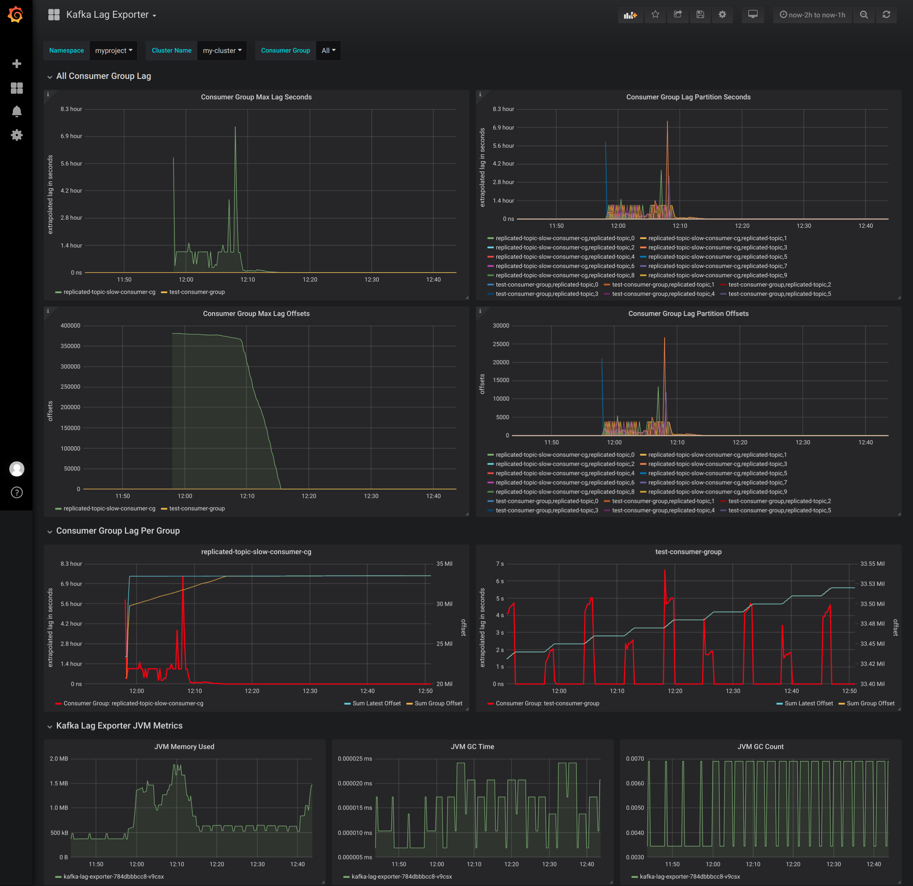

# Kafka Lag Exporter

> A Kafka consumer group lag exporter for Kubernetes

<!-- NOTE: The Travis build status includes a token that's only used for build status for this repo while it's private.  Replace with travis-ci.org when open sourced -->
[](https://travis-ci.com/lightbend/kafka-lag-exporter)

[](https://github.com/lightbend/kafka-lag-exporter/blob/master/LICENSE.txt)

The Kafka Lag Exporter is a Prometheus Exporter which will calculate the consumer lag for all consumer groups running
in a Kafka cluster.  It exports several consumer group related metrics, including an interpolation or extrapolation of 
consumer group lag in seconds.

We can calculate a reasonable approximation of consumer lag in seconds by applying a linear extrapolation formula to
predict the time that a consumer will reach the latest partition offset available based on previously measured
consumer group consumed offsets for the same partition.

For each poll interval we associate all the latest consumed offsets with current system time (wall clock).  After at
least two measurements are made we can extrapolate at what time an arbitrary offset in the future will be consumed.  As
a refresher, linear interpolation and extrapolation is just estimating a point on a slope and estimating its
coordinates. [Read this post for more details.](https://math.tutorvista.com/calculus/extrapolation.html)

## Metrics

The following metrics are exposed:

* `kafka_consumergroup_group_lag_seconds` - Extrapolated lag in seconds for each partition.
* `kafka_consumergroup_group_max_lag_seconds` - Max extrapolated lag in seconds for each consumer group.
* `kafka_consumergroup_group_lag` - Lag in offsets for each partition (latest offset - last consumed offset).
* `kafka_consumergroup_group_max_lag` - Max offset lag for each consumer group.
* `kafka_consumergroup_group_offset` - Last consumed offset for each consumer group partition.
* `kafka_partition_latest_offset` - Latest offset available for each partition.

## Configuration

Details for configuration for the Helm Chart can be found in the [`values.yaml`](./charts/kafka-lag-exporter/values.yaml)
file of the accompanying Helm Chart.

## Install with Helm

You can install the chart from the local filesystem.

```
helm install ./charts/kafka-lag-exporter
```

Or from the lightbend Helm Chart repository.

```
helm repo add lightbend https://repo.lightbend.com/helm-charts
helm install lightbend/kafka-lag-exporter
```

### Examples

Install with the [Strimzi](https://strimzi.io/) Kafka discovery feature.
See [Strimzi Kafka Cluster Watcher](#strimzi-kafka-cluster-watcher) for more details.

```
helm install ./charts/kafka-lag-exporter \
  --name kafka-lag-exporter \
  --namespace myproject \
  --set watchers.strimzi=true
```

Install with statically defined cluster at the CLI.

```
helm install ./charts/kafka-lag-exporter \
  --name kafka-lag-exporter \
  --namespace myproject \
  --set clusters\[0\].name=my-cluster \
  --set clusters\[0\].bootstrapBrokers=my-cluster-kafka-bootstrap:9092
```

Run a debug install (`DEBUG` logging, debug helm chart install, force docker pull policy to `Always`).

```
helm install ./charts/kafka-lag-exporter \
  --name kafka-lag-exporter \
  --namespace myproject \
  --set image.pullPolicy=Always \
  --set logLevel=DEBUG \
  --set clusters\[0\].name=my-cluster \
  --set clusters\[0\].bootstrapBrokers=my-cluster-kafka-bootstrap.myproject:9092 \
  --debug
```

### View the health endpoint

To view the Prometheus health endpoint from outside your Kubernetes cluster, use `kubectl port-forward`.

Ex)

```
kubectl port-forward service/kafka-lag-exporter-service 8080:8000 --namespace myproject
```

### Exporter logs

To view the logs of the exporter, identify the pod name of the exporter and use the `kubectl logs` command.

Ex)

```
kubectl logs {POD_ID} --namespace myproject -f
```

## Testing with local `docker-compose.yaml`

A Docker Compose cluster with producers and multiple consumer groups is defined in `./docker/docker-compose.yaml`.  This
is useful to manually test the project locally, without K8s infrastructure.  These images are based on the popular
[`wurstmeister`](https://hub.docker.com/r/wurstmeister/kafka/) Apache Kafka Docker images.  Confirm you match up the
version of these images with the correct version of Kafka you wish to test.

Remove any previous volume state.

```
docker-compose rm -f
```

Start up the cluster in the foreground.

```
docker-compose up
```

## Strimzi Kafka Cluster Watcher

When you install the chart with `--set watchers.strimzi=true` then the exporter will create a new `ClusterRole` and
`ClusterRoleBinding` to allow for the automatic discovery of [Strimzi](https://strimzi.io/) Kafka clusters.  The exporter will watch for
`Kafka` resources to be created or destroyed.  If the cluster already exists, or was created while the exporter was
online then it will automatically begin to collect consumer group metadata and export it.  If a `Kafka` resource is
destroyed then it will stop collecting consumer group metadata for that cluster.

The exporter will name the cluster the same as `Kafka` resources `metadata.name` field.

## Grafana Dashboard

A sample Grafana dashboard is provided in `./grafana/`.  It can be imported into a Grafana server that is configured
with a Prometheus datasource that is reading the Kafka Lag Exporter's Prometheus health endpoint.

The dashboard contains several high level user-configurable variables.

* **Namespace** - The namespace of the Kafka cluster.  Only 1 namespace can be selected at a time.
* **Cluster Name** - The name of the Kafka cluster.  Only 1 cluster name can be selected at a time.
* **Consumer Group** - The name of the Consumer Group.  This is a multi-select list which allows you to view the dashboard
for 1 to All consumer groups.

This dashboard has several rows that are described below.

* **All Consumer Group Lag** - A high level set of 4 panels.
  * Max lag in seconds per group
  * Lag in seconds per group partition
  * Max lag in offsets per group
  * Lag in offsets per group partition
* **Consumer Group Lag Per Group** - One panel for each consumer group that shows a sum of lag for all partitions on the
left Y axis.  The right Y axis has the sum of latest and last consumed offsets for all group partitions.
* **Kafka Lag Exporter JVM Metrics** - Critical JVM metrics for the Kafka Lag Exporter itself.

Example snapshot of dashboard showing all Consumer Groups (2)



## Release Process

1. Update the Change Log
2. Run `./scripts/release.sh` which will do the following:
  * Run `compile` and `test` targets.  A pre-compile task will automatically update the version in the Helm Chart.
  * Publish docker image to DockerHub at `lightbend/kafka-lag-exporter`.  If not publishing to `lightbend` repository,
     update `./build.sbt` file with the correct repository, or publish locally instead (`sbt docker:publishLocal`).
  * Bundle Helm Chart into a tarball artifact.  The `helm package` command will output the artifact in the CWD it is
     executed from.
3. Upload the tarball to a Helm Chart Repository.

## Change log

0.4.0

* Add Integration tests using Embedded Kafka #11
* Replace lag in time implementation with interpolation table implementation #5
* Removed `spark-event-exporter`.  See the [`spark-committer`](https://github.com/lightbend/spark-committer) GitHub
project to commit offsets in Spark Structured Streaming back to Kafka. #9
* Implement backoff strategy for Kafka connections in Kafka Lag Exporter #6

0.3.6

* Add `kafka-client-timeout` config.
* Tune retry and timeout logic of Kafka admin client and consumer
* Use backoff strategy restarting offset collection logic when transient runtime exceptions are encountered
* Terminate when Prometheus HTTP server can't start (i.e. port can't be bound)

0.3.1

* Default partition to 0 (instead of omitting it from being reported) when a consumer group returns no offset for a
group partition
* Use `akkaSource` for actor path in logging

0.3.0

* Bugfix: Parse `poll-interval` in seconds
* Rename metric from `kafka_consumergroup_latest_offset` to `kafka_partition_latest_offset`
* Use JVM 8 experimental cgroup memory awareness flags when running exporter in container
* Use snakecase for metric label names
* Sample Grafana Dashboard

0.2.0

* Strimzi cluster auto discovery

0.1.0

* Initial release

