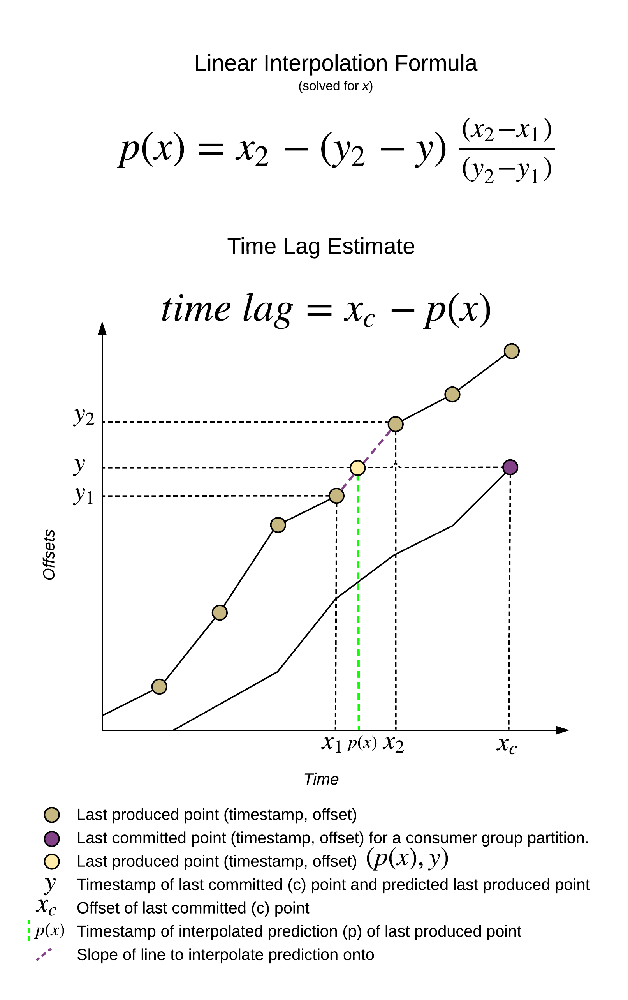
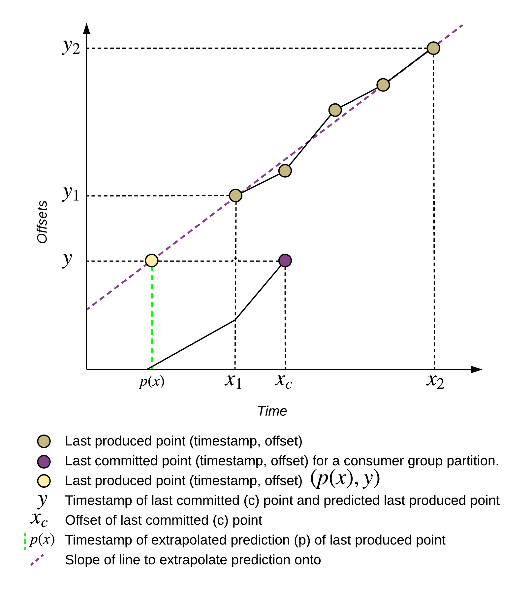
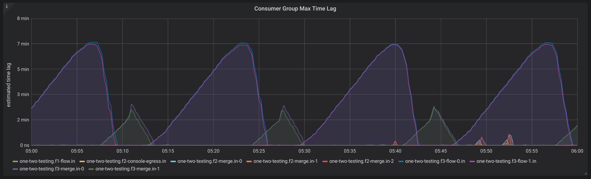
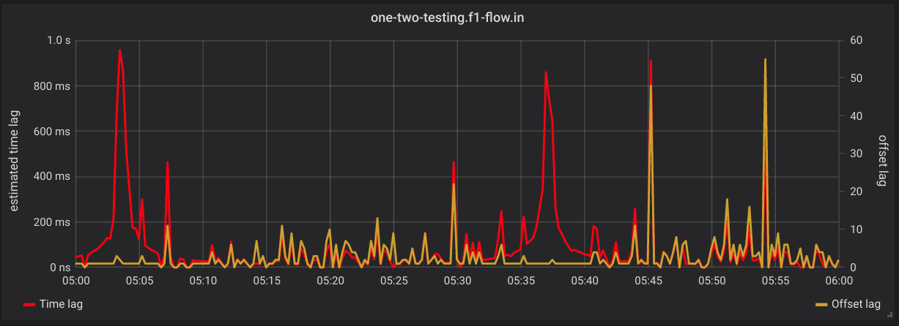
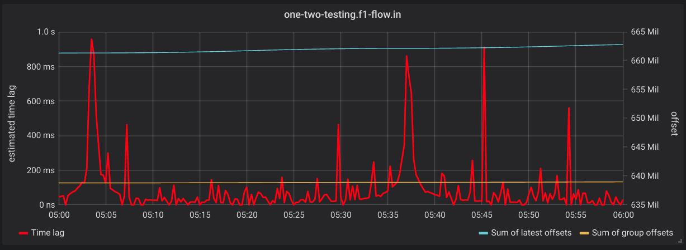

[](https://travis-ci.org/lightbend/kafka-lag-exporter)

[](https://github.com/lightbend/kafka-lag-exporter/blob/master/LICENSE.txt)

# Kafka Lag Exporter

> Monitor Kafka Consumer Group Latency with Kafka Lag Exporter

<!-- START doctoc generated TOC please keep comment here to allow auto update -->
<!-- DON'T EDIT THIS SECTION, INSTEAD RE-RUN doctoc TO UPDATE -->

- [Introduction](#introduction)
- [Metrics](#metrics)
  - [Labels](#labels)
- [Configuration](#configuration)
- [Install with Helm](#install-with-helm)
  - [Examples](#examples)
  - [View the health endpoint](#view-the-health-endpoint)
  - [View exporter logs](#view-exporter-logs)
- [Estimate Consumer Group Time Lag](#estimate-consumer-group-time-lag)
- [Strimzi Kafka Cluster Watcher](#strimzi-kafka-cluster-watcher)
- [Monitoring with Grafana](#monitoring-with-grafana)
- [Development](#development)
  - [Tests](#tests)
  - [Testing with local `docker-compose.yaml`](#testing-with-local-docker-composeyaml)
  - [Building your own Helm Chart](#building-your-own-helm-chart)
- [Release](#release)
  - [Pre-requisites](#pre-requisites)
  - [Release steps](#release-steps)
- [Change log](#change-log)

<!-- END doctoc generated TOC please keep comment here to allow auto update -->

## Introduction

Kafka Lag Exporter makes it easy to view the latency of your [Apache Kafka](https://kafka.apache.org/) 
consumer groups. It can run anywhere, but it provides features to run easily on [Kubernetes](https://kubernetes.io/) 
clusters against [Strimzi](https://strimzi.io/) Kafka clusters using the [Prometheus](https://prometheus.io/) and [Grafana](https://grafana.com/) 
monitoring stack. Kafka Lag Exporter is an [Akka Typed](https://doc.akka.io/docs/akka/current/typed/index.html) 
application written in [Scala](https://www.scala-lang.org/).

For more information about Kafka Lag Exporter's features see Lightbend's blog post: 
[Monitor Kafka Consumer Group Latency with Kafka Lag Exporter](https://www.lightbend.com/blog/monitor-kafka-consumer-group-latency-with-kafka-lag-exporter).

**Project Status:** *beta*

## Metrics

[Prometheus](https://prometheus.io/) is a standard way to represent metrics in a modern cross-platform manner. Kafka Lag 
Exporter exposes several metrics as an HTTP endpoint that can be readily scraped by Prometheus. When installed using 
Helm and when enabling the Kubernetes pod self-discovery features within Prometheus server, Prometheus server will 
automatically detect the HTTP endpoint and scrape its data.

**`kafka_consumergroup_group_offset`**

Labels: `cluster_name, group, topic, partition, state, is_simple_consumer, member_host, consumer_id, client_id`

The offset of the last consumed offset for this partition in this topic partition for this group.

**`kafka_consumergroup_group_lag`**

Labels: `cluster_name, group, topic, partition, state, is_simple_consumer, member_host, consumer_id, client_id`

The difference between the last produced offset and the last consumed offset for this partition in this topic partition for this group.

**`kafka_consumergroup_group_lag_seconds`**

Labels: `cluster_name, group, topic, partition, state, is_simple_consumer, member_host, consumer_id, client_id`

The estimated lag in seconds.  This metric correlates with lag in offsets.  For more information on how this is calculated read the Estimate consumer group lag in time section below.

**`kafka_consumergroup_group_max_lag`**

Labels: `cluster_name, group, state, is_simple_consumer`

The highest (maximum) lag in offsets for a given consumer group.

**`kafka_consumergroup_group_max_lag_seconds`**

Labels: `cluster_name, group, state, is_simple_consumer`

The highest (maximum) lag in time for a given consumer group.

**`kafka_partition_latest_offset`**

Labels: `cluster_name, topic, partition`

The latest offset available for topic partition.  Kafka Lag Exporter will calculate a set of partitions for all consumer groups available and then poll for the last produced offset.  The last produced offset is used in the calculation of other metrics provided, so it is exported for informational purposes.  For example, the accompanying Grafana dashboard makes use of it to visualize the last produced offset and the last consumed offset in certain panels.

### Labels

Each metric may include the following labels when reported.

* `cluster_name` - Either the statically defined Kafka cluster name, or the metadata.name of the Strimzi Kafka cluster that was discovered with the Strimzi auto discovery feature.
* `topic` - The Kafka topic.
* `partition` - The Kafka partition.
* `group` - The Kafka consumer group.id.

The rest of the labels are passed along from the consumer group metadata requests.

* `state` - The state of the consumer group when the group data was polled.
* `is_simple_consumer` - Is this group using the [old] simple consumer API.
* `member_host` - The hostname or IP of the machine or container running the consumer group member that is assigned this partition.
* `client_id` - The id of the consumer group member.  This is usually generated automatically by the group coordinator.
* `consumer_id` - The globally unique id of the consumer group member.  This is usually a combination of the client_id and a GUID generated by the group coordinator.

Prometheus server may add additional labels based on your configuration.  For example, Kubernetes pod information about the Kafka Lag Exporter pod where the metrics were scraped from.

## Configuration

Details for configuration for the Helm Chart can be found in the [`values.yaml`](./charts/kafka-lag-exporter/values.yaml)
file of the accompanying Helm Chart.

## Install with Helm

You can install the chart from the local filesystem.

```
helm install https://github.com/lightbend/kafka-lag-exporter/releases/download/v0.4.0/kafka-lag-exporter-0.4.0.tgz
```

### Examples

Install with the [Strimzi](https://strimzi.io/) Kafka discovery feature.
See [Strimzi Kafka Cluster Watcher](#strimzi-kafka-cluster-watcher) for more details.

```
helm install https://github.com/lightbend/kafka-lag-exporter/releases/download/v0.4.0/kafka-lag-exporter-0.4.0.tgz \
  --name kafka-lag-exporter \
  --namespace kafka-lag-exporter \
  --set watchers.strimzi=true
```

Install with statically defined cluster at the CLI.

```
helm install https://github.com/lightbend/kafka-lag-exporter/releases/download/v0.4.0/kafka-lag-exporter-0.4.0.tgz \
  --name kafka-lag-exporter \
  --namespace myproject \
  --set clusters\[0\].name=my-cluster \
  --set clusters\[0\].bootstrapBrokers=my-cluster-kafka-bootstrap:9092
```

Run a debug install (`DEBUG` logging, debug helm chart install, force docker pull policy to `Always`).

```
helm install https://github.com/lightbend/kafka-lag-exporter/releases/download/v0.4.0/kafka-lag-exporter-0.4.0.tgz \
  --name kafka-lag-exporter \
  --namespace myproject \
  --set image.pullPolicy=Always \
  --set logLevel=DEBUG \
  --set clusters\[0\].name=my-cluster \
  --set clusters\[0\].bootstrapBrokers=my-cluster-kafka-bootstrap.myproject:9092 \
  --debug
```

### View the health endpoint

To view the Prometheus health endpoint from outside your Kubernetes cluster, use `kubectl port-forward`.

Ex)

```
kubectl port-forward service/kafka-lag-exporter-service 8080:8000 --namespace myproject
```

### View exporter logs

To view the logs of the exporter, identify the pod name of the exporter and use the `kubectl logs` command.

Ex)

```
kubectl logs {POD_ID} --namespace myproject -f
```

## Estimate Consumer Group Time Lag

One of Kafka Lag Exporter’s more unique features is its ability to estimate the length of time that a consumer group is behind the last produced value for a particular partition, time lag.  Offset lag is useful to indicate that the consumer group is lagging, but it doesn’t provide a sense of the actual latency of the consuming application.  

For example, a topic with two consumer groups may have different lag characteristics.  Application A is a consumer which performs CPU intensive (and slow) business logic on each message it receives. It’s distributed across many consumer group members to handle the high load, but since its processing throughput is slower it takes longer to process each message per partition.   Meanwhile Application B is a consumer which performs a simple ETL operation to land streaming data in another system, such as an HDFS data lake.  It may have similar offset lag to Application A, but because it has a higher processing throughput its lag in time may be significantly less.

It’s easier to build monitoring alerts using a time lag measurement than an offset lag measurement, because latency is best described in requirements as a unit of time.

There are several ways to calculate time lag. The easiest way would be to parse the message timestamp and subtract it from the current time. However, this requires us to actually poll for messages in each partition that we wish to calculate time lag for. We must download the message payload and parse this information out of a `ConsumerRecord`. This is an expensive operation to perform and will likely not scale well in the general use case where messages can be of any size (though less than 1MB, unless default broker config is changed) and the number of partitions for any given topic could range into to thousands. However, it would be an interesting feature to explore in the future. It would also be possible to instrument the Kafka consuming application itself to report this metric since it can readily sample messages it's already consuming for their timestamp property and perform the calculation, but this requires each Kafka consuming application to opt into this implementation in order for it to be monitored. Another way to determine time lag is to estimate it based on consumer group lag information we already have available.

Kafka Lag Exporter estimates time lag by either interpolation or extrapolation of the timestamp of when the last consumed offset was first produced.  We begin by retrieving the source data from Kafka.  We poll the last produced offset for all partitions in all consumer groups and store the offset (x) and current time (y) as a coordinate in a table (the interpolation table) for each partition.  This information is retrieved as a metadata call using the `KafkaConsumer` `endOffsets` call and does not require us to actually poll for messages.  The Kafka Consumer Group coordinator will return the last produced offsets for all the partitions we are subscribed to (the set of all partitions of all consumer groups).  Similarly, we use the Kafka `AdminClient`’s `listConsumerGroupOffsets` API to poll for consumer group metadata from all consumer groups to get the last consumed offset for each partition in a consumer group.

Once we’ve built up an interpolation table of at least two values we can begin estimating time lag by performing the following operations (some edge cases are omitted for clarity) for each last consumed offset of each partition.

1. Lookup interpolation table for a consumer group partition
2. Find two points within the table that contain the last consumed offset
  1. If there are no two points that contain the last consumed offset then use the first and last points as input to the interpolation formula.  This is the extrapolation use case.
3. Interpolate inside (or extrapolate outside) the two points from the table we picked to predict a timestamp for when the last consumed message was first produced.
4. Take the difference of the time of the last consumed offset (~ the current time) and the predicted timestamp to find the time lag.

Below you will find a diagram that demonstrates the interpolation use case.



The extrapolation use case uses different points in the interpolation table (the first and last points), but the calculation is the same.



Interpolation is always desirable because we can be more assured that the prediction will be more accurate because we’re plotting a point within two points of our existing dataset.  Extrapolation will always be less accurate because we’re predicting points that may be a fair distance away from our dataset.

## Strimzi Kafka Cluster Watcher

When you install the chart with `--set watchers.strimzi=true` then the exporter will create a new `ClusterRole` and
`ClusterRoleBinding` to allow for the automatic discovery of [Strimzi](https://strimzi.io/) Kafka clusters.  The exporter will watch for
`Kafka` resources to be created or destroyed.  If the cluster already exists, or was created while the exporter was
online then it will automatically begin to collect consumer group metadata and export it.  If a `Kafka` resource is
destroyed then it will stop collecting consumer group metadata for that cluster.

The exporter will name the cluster the same as `Kafka` resources `metadata.name` field.

## Monitoring with Grafana

A sample Grafana dashboard is provided in `./grafana/`.  It can be imported into a Grafana server that is configured
with a Prometheus datasource that is reading the Kafka Lag Exporter's Prometheus health endpoint.

The dashboard contains several high level user-configurable variables.

* **Namespace** - The namespace of the Kafka Lag Exporter.  Only 1 namespace can be selected at a time.
* **Cluster Name** - The name of the Kafka cluster.  Only 1 cluster name can be selected at a time.
* **Consumer Group** - The name of the Consumer Group.  This is a multi-select list which allows you to view the dashboard
for 1 to All consumer groups.

This dashboard has 4 rows that are described below.

1. **All Consumer Group Lag** - A high level set of 4 panels.
  * Consumer Group Max Time Lag
  * Consumer Group Time Lag Top Partitions
  * Consumer Group Max Offset Lag
  * Consumer Group Offset Lag Top Partitions

2. **Max Consumer Group Time Lag Over Offset Lag** - One panel for each consumer group that shows the max lag 
in time on the left Y axis and max lag in offsets on the right Y axis. Ex)

3. **Max Consumer Group Time Lag Over Summed Offsets** - One panel for each consumer group that shows the max lag in time on the left Y 
axis.  The right Y axis has the sum of latest and last consumed offsets for all group partitions. Ex)

4. **Kafka Lag Exporter JVM Metrics** - JVM metrics for the Kafka Lag Exporter itself.

## Development

### Tests

Kafka Lag Exporter has unit and integration tests.  The integration tests use [Alpakka Kafka Testkit](https://doc.akka.io/docs/akka-stream-kafka/current/testing.html#testing-with-an-embedded-kafka-server)
to provide an embedded Kafka instance and simulate consumer group lag.

Run all tests with SBT.

```
sbt test
```

### Testing with local `docker-compose.yaml`

A Docker Compose cluster with producers and multiple consumer groups is defined in `./docker/docker-compose.yaml`.  This
is useful to manually test the project locally, without K8s infrastructure.  These images are based on the popular
[`wurstmeister`](https://hub.docker.com/r/wurstmeister/kafka/) Apache Kafka Docker images.  Confirm you match up the
version of these images with the correct version of Kafka you wish to test.

To configure cluster connection info either create an `application.conf` or pass environment variables.

```
KAFKA_LAG_EXPORTER_CLUSTERS.0.name=default
KAFKA_LAG_EXPORTER_CLUSTERS.0.bootstrap-brokers=localhost:9094
```


Remove any previous volume state.

```
docker-compose rm -f
```

Start up the cluster in the foreground.

```
docker-compose up
```

### Building your own Helm Chart

If you want to build your own Helm Chart and accompanying docker images you can override the Docker repository and 
username with environment variables.

`DOCKER_REPOSITORY` - A custom Docker repository, such as a private company's docker repository (defaults to DockerHub)
`DOCKER_USERNAME` - A custom Docker username (defaults to `lightbend`)

Run the `updateHelmChart` sbt task to update the Helm Chart with the appropriate Docker repository and username.

Run the `docker:publishLocal` sbt task to publish a local Docker image.

Run the `docker:publish` sbt task to publish the Docker image to the specified Docker repository.

For example, to update the Helm Chart to use a custom docker registry and username and to publish the chart locally.

```
$ export DOCKER_REPOSITORY="docker.xyzcorp.com"
$ export DOCKER_USERNAME="foobar"
$ sbt updateHelmChart docker:publishLocal
[info] Loading settings for project global-plugins from idea.sbt ...
[info] Loading global plugins from /home/seglo/.sbt/1.0/plugins
[info] Loading settings for project kafka-lag-exporter-build from plugins.sbt ...
[info] Loading project definition from /home/seglo/source/kafka-lag-exporter/project
[info] Loading settings for project kafka-lag-exporter from version.sbt,build.sbt ...
[info] Set current project to kafka-lag-exporter (in build file:/home/seglo/source/kafka-lag-exporter/)
Update Chart.yaml appVersion to 0.4.0-SNAPSHOT and version to 0.4.0
Update values.yaml docker image tag to 0.4.0-SNAPSHOT
Update values.yaml docker repository to docker.xyzcorp.com/foobar/kafka-lag-exporter
...
[info] Successfully built f392402958b7
[info] Successfully tagged docker.xyzcorp.com/foobar/kafka-lag-exporter:0.4.0-SNAPSHOT
[info] Built image docker.xyzcorp.com/foobar/kafka-lag-exporter with tags [0.4.0-SNAPSHOT]
[success] Total time: 17 s, completed 1-May-2019 2:37:28 PM
``` 

## Release

### Pre-requisites

The release process is orchestrated by the [`sbt-release`](https://github.com/sbt/sbt-release).  Privileged access is 
required.  Before running a release make sure the following pre-req's are met.

* Authenticated with Docker Hub with the `docker` command.
* Authenticated with GitHub
* `~/.netrc` file setup with GitHub credentials/token 

### Release steps

1. Update the Change log
2. Run `doctoc` on `README.md`
3. Run `sbt release`.  To see what steps are performed during release consult the `build.sbt`.
4. Review the GitHub release draft and submit it.

## Change log

0.4.0

* Open Sourced! 🎆 [#17](https://github.com/lightbend/kafka-lag-exporter/issues/17)
* Add Integration tests using Embedded Kafka [#11](https://github.com/lightbend/kafka-lag-exporter/issues/11)
* Replace lag in time implementation with interpolation table implementation [#5](https://github.com/lightbend/kafka-lag-exporter/issues/5)
* Removed `spark-event-exporter`.  See the [`spark-committer`](https://github.com/lightbend/spark-committer) GitHub
project to commit offsets in Spark Structured Streaming back to Kafka. [#9](https://github.com/lightbend/kafka-lag-exporter/issues/9)
* Implement backoff strategy for Kafka connections in Kafka Lag Exporter [#6](https://github.com/lightbend/kafka-lag-exporter/issues/6)
* Travis build [#7](https://github.com/lightbend/kafka-lag-exporter/issues/7)
* Update docs [#14](https://github.com/lightbend/kafka-lag-exporter/issues/14)
* Update Grafana dashboard
* Licensing headers
* Script release process

0.3.6

* Add `kafka-client-timeout` config.
* Tune retry and timeout logic of Kafka admin client and consumer
* Use backoff strategy restarting offset collection logic when transient runtime exceptions are encountered
* Terminate when Prometheus HTTP server can't start (i.e. port can't be bound)

0.3.1

* Default partition to 0 (instead of omitting it from being reported) when a consumer group returns no offset for a
group partition
* Use `akkaSource` for actor path in logging

0.3.0

* Bugfix: Parse `poll-interval` in seconds
* Rename metric from `kafka_consumergroup_latest_offset` to `kafka_partition_latest_offset`
* Use JVM 8 experimental cgroup memory awareness flags when running exporter in container
* Use snakecase for metric label names
* Sample Grafana Dashboard

0.2.0

* Strimzi cluster auto discovery

0.1.0

* Initial release


