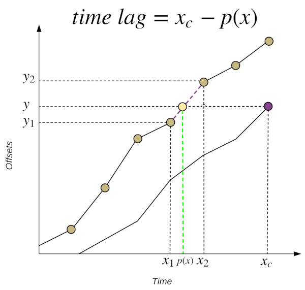

Kafka Lag Exporter [![gh-release-badge][]][gh-release] [![gh-actions-badge][]][gh-actions] [![license-badge][]][license] [![patreon-badge][]][patreon]
==================

[gh-release]:          https://github.com/seglo/kafka-lag-exporter/releases
[gh-release-badge]:    https://img.shields.io/github/v/release/seglo/kafka-lag-exporter?include_prereleases
[gh-actions]:          https://github.com/seglo/kafka-lag-exporter/actions
[gh-actions-badge]:    https://github.com/seglo/kafka-lag-exporter/workflows/CI/badge.svg?branch=master
[license]:             https://github.com/seglo/kafka-lag-exporter/blob/master/LICENSE.txt
[license-badge]:       https://img.shields.io/badge/License-Apache%202.0-blue.svg
[patreon]:             https://www.patreon.com/seglo
[patreon-badge]:       https://img.shields.io/badge/patreon-sponsor-ff69b4.svg

> Monitor Kafka Consumer Group Latency with Kafka Lag Exporter

## Overview

Kafka Lag Exporter makes it easy to view the offset lag and calculate an estimate of latency (residence time) of your [Apache Kafka](https://kafka.apache.org/) consumer groups.
It can run anywhere, but it provides features to run easily on [Kubernetes](https://kubernetes.io/) clusters against [Strimzi](https://strimzi.io/) Kafka clusters using the [Prometheus](https://prometheus.io/) and [Grafana](https://grafana.com/) monitoring stack. 
Kafka Lag Exporter is an [Akka Typed](https://doc.akka.io/docs/akka/current/typed/index.html) application written in [Scala](https://www.scala-lang.org/).

Kafka Lag Exporter is maintained by [Sean Glover](https://seanglover.com) ([@seglo](https://github.com/seglo)) and a community of contributors.
If you like using this project and would like to support its development, please consider a donation using [Patreon][patreon].

_Kafka Lag Exporter interpolates latency based on observed latest committed offset measurements of consumer groups._



For more information about Kafka Lag Exporter's features see Lightbend's blog post:
[Monitor Kafka Consumer Group Latency with Kafka Lag Exporter](https://www.lightbend.com/blog/monitor-kafka-consumer-group-latency-with-kafka-lag-exporter).

## Contents

<!-- START doctoc generated TOC please keep comment here to allow auto update -->
<!-- DON'T EDIT THIS SECTION, INSTEAD RE-RUN doctoc TO UPDATE -->

- [Metrics](#metrics)
  - [Labels](#labels)
- [Run on Kubernetes](#run-on-kubernetes)
  - [Configuration](#configuration)
  - [Install with Helm](#install-with-helm)
    - [Examples](#examples)
  - [View the health endpoint](#view-the-health-endpoint)
    - [View exporter logs](#view-exporter-logs)
- [Run Standalone](#run-standalone)
  - [Reporters](#reporters)
  - [Configuration](#configuration-1)
  - [Run as Java App](#run-as-java-app)
  - [Run as Docker Image](#run-as-docker-image)
- [Troubleshooting](#troubleshooting)
- [Required Permissions for Kafka ACL](#required-permissions-for-kafka-acl)
- [Strimzi Kafka Cluster Watcher](#strimzi-kafka-cluster-watcher)
- [Monitoring with Grafana](#monitoring-with-grafana)
- [Filtering Metrics without Prometheus Server](#filtering-metrics-without-prometheus-server)
- [Health Check](#health-check)
- [Development](#development)
  - [Tests](#tests)
  - [Testing with local `docker-compose.yaml`](#testing-with-local-docker-composeyaml)
  - [Building your own Helm Chart](#building-your-own-helm-chart)
- [Release](#release)
  - [Pre-requisites](#pre-requisites)
  - [Release steps](#release-steps)
- [Change log](#change-log)

<!-- END doctoc generated TOC please keep comment here to allow auto update -->

## Metrics

[Prometheus](https://prometheus.io/) is a standard way to represent metrics in a modern cross-platform manner. Kafka Lag
Exporter exposes several metrics as an HTTP endpoint that can be readily scraped by Prometheus. When installed using
Helm and when enabling the Kubernetes pod self-discovery features within Prometheus server, Prometheus server will
automatically detect the HTTP endpoint and scrape its data.

**`kafka_consumergroup_group_offset`**

Labels: `cluster_name, group, topic, partition, member_host, consumer_id, client_id`

The offset of the last consumed offset for this partition in this topic partition for this group.

**`kafka_consumergroup_group_lag`**

Labels: `cluster_name, group, topic, partition, member_host, consumer_id, client_id`

The difference between the last produced offset and the last consumed offset for this partition in this topic partition for this group.

**`kafka_consumergroup_group_lag_seconds`**

Labels: `cluster_name, group, topic, partition, member_host, consumer_id, client_id`

The estimated lag in seconds.  This metric correlates with lag in offsets.  For more information on how this is calculated read the Estimate consumer group lag in time section below.

**`kafka_consumergroup_group_max_lag`**

Labels: `cluster_name, group, is_simple_consumer`

The highest (maximum) lag in offsets for a given consumer group.

**`kafka_consumergroup_group_max_lag_seconds`**

Labels: `cluster_name, group, is_simple_consumer`

The highest (maximum) lag in time for a given consumer group.

**`kafka_consumergroup_group_sum_lag`**

Labels: `cluster_name, group`

The sum of the difference between the last produced offset and the last consumed offset of all partitions for this group.

**`kafka_consumergroup_group_topic_sum_lag`**

Labels: `cluster_name, group, topic`

The sum of the difference between the last produced offset and the last consumed offset of all partitions in this topic for this group.

**`kafka_partition_latest_offset`**

Labels: `cluster_name, topic, partition`

The latest offset available for topic partition.  Kafka Lag Exporter will calculate a set of partitions for all consumer groups available and then poll for the last produced offset.  The last produced offset is used in the calculation of other metrics provided, so it is exported for informational purposes.  For example, the accompanying Grafana dashboard makes use of it to visualize the last produced offset and the last consumed offset in certain panels.

**`kafka_partition_earliest_offset`**

Labels: `cluster_name, topic, partition`

The earliest offset available for topic partition.  Kafka Lag Exporter will calculate a set of partitions for all consumer groups available and then poll for the earliest available offset.  The earliest available offset is used in the calculation of other metrics provided, so it is exported for informational purposes.  For example, the accompanying Grafana dashboard makes use of it to visualize the offset-based volume of a partition in certain panels.

**`kafka_consumergroup_poll_time_ms`**

Labels: `cluster_name`

The time taken to poll (milli seconds) all the information from all consumer groups for every cluster. 

### Labels

Each metric may include the following labels when reported. If you define the `labels` property for configuration of a cluster then those labels will also be included. 
The superset of all `labels` defined for all cluster configurations are used for each metric. This is due to a restriction in the Java Prometheus client library that only allows us to define one set of labels per metric. Therefore, if the label names across cluster configurations are not consistent then the missing labels for each cluster will appear as blank values (`""`) in the reported metric. An alternative to defining labels in Kafka Lag Exporter is to define [relabeling rules](https://prometheus.io/docs/prometheus/latest/configuration/configuration/#relabel_config) in your Prometheus server configuration.

* `cluster_name` - Either the statically defined Kafka cluster name, or the metadata.name of the Strimzi Kafka cluster that was discovered with the Strimzi auto discovery feature.
* `topic` - The Kafka topic.
* `partition` - The Kafka partition.
* `group` - The Kafka consumer group.id.

The rest of the labels are passed along from the consumer group metadata requests.

* `member_host` - The hostname or IP of the machine or container running the consumer group member that is assigned this partition.
* `client_id` - The id of the consumer group member.  This is usually generated automatically by the group coordinator.
* `consumer_id` - The globally unique id of the consumer group member.  This is usually a combination of the client_id and a GUID generated by the group coordinator.

Prometheus server may add additional labels based on your configuration.  For example, Kubernetes pod information about the Kafka Lag Exporter pod where the metrics were scraped from.

## Run on Kubernetes

### Configuration

Details for configuration for the Helm Chart can be found in the [`values.yaml`](./charts/kafka-lag-exporter/values.yaml)
file of the accompanying Helm Chart.

### Install with Helm

You can install the chart from the chart repository at the following location
* [https://seglo.github.io/kafka-lag-exporter/repo/index.yaml](https://seglo.github.io/kafka-lag-exporter/repo/index.yaml)

```
helm repo add kafka-lag-exporter https://seglo.github.io/kafka-lag-exporter/repo/
helm repo update

helm install kafka-lag-exporter/kafka-lag-exporter 
```

#### Examples

Install with the [Strimzi](https://strimzi.io/) Kafka discovery feature.
See [Strimzi Kafka Cluster Watcher](#strimzi-kafka-cluster-watcher) for more details.

```
helm install kafka-lag-exporter/kafka-lag-exporter \
  --name kafka-lag-exporter \
  --namespace kafka-lag-exporter \
  --set watchers.strimzi=true
```

Install with statically defined cluster at the CLI.

```
helm install kafka-lag-exporter/kafka-lag-exporter \
  --name kafka-lag-exporter \
  --namespace myproject \
  --set clusters\[0\].name=my-cluster \
  --set clusters\[0\].bootstrapBrokers=my-cluster-kafka-bootstrap:9092
```

Install with statically defined cluster at the CLI, but with a non-default service account assigned to the deployment.

```
helm install kafka-lag-exporter/kafka-lag-exporter \
  --name kafka-lag-exporter \
  --namespace myproject \
  --set clusters\[0\].name=my-cluster \
  --set clusters\[0\].bootstrapBrokers=my-cluster-kafka-bootstrap:9092 \
  --set serviceAccount.create=true
```

Install with Redis persistence enabled

```
helm install kafka-lag-exporter/kafka-lag-exporter \
  --name kafka-lag-exporter \
  --namespace myproject \
  --set redis.enabled=true \
  --set redis.host=myredisserver \
  --set clusters\[0\].name=my-cluster \
  --set clusters\[0\].bootstrapBrokers=my-cluster-kafka-bootstrap.myproject:9092
```

Run a debug install (`DEBUG` logging, debug helm chart install, force docker pull policy to `Always`).

```
helm repo update  # force refresh chart version
helm install kafka-lag-exporter/kafka-lag-exporter \
  --name kafka-lag-exporter \
  --namespace myproject \
  --set image.pullPolicy=Always \
  --set logLevel=DEBUG \
  --set clusters\[0\].name=my-cluster \
  --set clusters\[0\].bootstrapBrokers=my-cluster-kafka-bootstrap.myproject:9092 \
  --debug
```

### View the health endpoint

To view the Prometheus health endpoint from outside your Kubernetes cluster, use `kubectl port-forward`.

Ex)

```
kubectl port-forward service/kafka-lag-exporter-service 8080:8000 --namespace myproject
```

#### View exporter logs

To view the logs of the exporter, identify the pod name of the exporter and use the `kubectl logs` command.

Ex)

```
kubectl logs {POD_ID} --namespace myproject -f
```

## Run Standalone

To run the project in standalone mode you must first define a configuration `application.conf`. This configuration must
contain at least connection info to your Kafka cluster (`kafka-lag-exporter.clusters`). All other configuration has
defaults defined in the project itself.  See [`reference.conf`](./src/main/resources/reference.conf) for defaults.

### Reporters

It is possible to report (either one, multiple or all):

  - to influxdb via the config `kafka-lag-exporter.reporters.influxdb`
  - to graphite via the config `kafka-lag-exporter.reporters.graphite`
  - as prometheus via the config `kafka-lag-exporter.reporters.prometheus`

You must also specify the active reporters in the `kafka-lag-exporter.sinks` config.

See section below for more information.

### Configuration

General Configuration (`kafka-lag-exporter{}`)

| Key                                     | Default                      | Description                                                                                                                                                                                                           |
|-----------------------------------------|------------------------------|-----------------------------------------------------------------------------------------------------------------------------------------------------------------------------------------------------------------------|
| `reporters.prometheus.port`             | `8000`                       | The port to run the Prometheus endpoint on                                                                                                                                                                            |
| `reporters.graphite.host`               | None                         | The graphite host to send metrics to (if not set, will not output to graphite)                                                                                                                                        |
| `reporters.graphite.port`               | None                         | The graphite port to send metrics to (if not set, will not output to graphite)                                                                                                                                        |
| `reporters.graphite.prefix`             | None                         | The graphite metric prefix (if not set, prefix will be empty)                                                                                                                                                         |
| `reporters.influxdb.endpoint`           | None                         | The influxdb V1 host to send metrics to (if not set, will not output to influxdb)                                                                                                                                     |
| `reporters.influxdb.port`               | None                         | The influxdb V1 port to send metrics to (if not set, will not output to influxdb)                                                                                                                                     |
| `reporters.influxdb.database`           | `kafka_lag_exporter`         | The influxdb V1 database to send metrics to                                                                                                                                                                           |
| `reporters.influxdb.username`           | None                         | The influxdb V1 username to connect (if not set, username will be empty)                                                                                                                                              |
| `reporters.influxdb.password`           | None                         | The influxdb V1 password to connect (if not set, password will be empty)                                                                                                                                              |
| `reporters.influxdb.async`              | `true`                       | Flag to enable influxdb async **non-blocking** write mode to send metrics                                                                                                                                             |
| `reporters.influxdb2.endpoint`          | None                         | The influxdb V2 host to send metrics to (if not set, will not output to influxdb)                                                                                                                                     |
| `reporters.influxdb2.port`              | None                         | The influxdb V2 port to send metrics to (if not set, will not output to influxdb)                                                                                                                                     |
| `reporters.influxdb2.bucket`            | `kafka_lag_exporter`         | The influxdb V2 bucket name to send metrics to                                                                                                                                                                        |
| `reporters.influxdb2.retention-seconds` | 604800                       | The influxdb V2 data bucket retention seconds default is 7 weeks                                                                                                                                                      |
| `reporters.influxdb2.org-id`            | None                         | The influxdb V2 Org Id                                                                                                                                                                                                |
| `reporters.influxdb2.org-name`          | None                         | The influxdb V2 Org name                                                                                                                                                                                              |
| `reporters.influxdb2.org-id`            | None                         | The influxdb V2 Org Id                                                                                                                                                                                                |
| `reporters.influxdb2.token`             | None                         | The influxdb V2 token that can access the bucket                                                                                                                                                                      |
| `sinks`                                 | `["PrometheusEndpointSink"]` | Specify which reporters must be used to send metrics. Possible values are: `PrometheusEndpointSink`, `InfluxDBPusherSink`, `InfluxDB2PusherSink`, `GraphiteEndpointSink`.  (if not set, only Prometheus is activated) | 
| `poll-interval`                         | `30 seconds`                 | How often to poll Kafka for latest and group offsets                                                                                                                                                                  |
| `lookup-table.memory.size`              | `60`                         | The maximum window size of the in memory look up table **per partition**                                                                                                                                              |
| `lookup-table.redis`                    | `{}`                         | Configuration for the Redis persistence. This category is optional and will override use of the in memory lookup table if defined                                                                                     |
| `client-group-id`                       | `kafkalagexporter`           | Consumer group id of kafka-lag-exporter's client connections                                                                                                                                                          |
| `kafka-client-timeout`                  | `10 seconds`                 | Connection timeout when making API calls to Kafka                                                                                                                                                                     |
| `clusters`                              | `[]`                         | A statically defined list of Kafka connection details.  This list is optional if you choose to use the Strimzi auto-discovery feature                                                                                 |
| `watchers`                              | `{}`                         | Settings for Kafka cluster "watchers" used for auto-discovery.                                                                                                                                                        |
| `metric-whitelist`                      | `[".*"]`                     | Regex of metrics to be exposed via Prometheus endpoint. Eg. `[".*_max_lag.*", "kafka_partition_latest_offset"]`                                                                                                       |

Kafka Cluster Connection Details (`kafka-lag-exporter.clusters[]`)

| Key                       | Default     | Required | Description                                                                                                                                                                                               |
|---------------------------|-------------|----------|-----------------------------------------------------------------------------------------------------------------------------------------------------------------------------------------------------------|
| `name`                    | `""`        | Yes      | A unique cluster name to for this Kafka connection detail object                                                                                                                                          |
| `bootstrap-brokers`       | `""`        | Yes      | Kafka bootstrap brokers.  Comma delimited list of broker hostnames                                                                                                                                        |
| `group-whitelist`         | `[".*"]`    | No       | A list of Regex of consumer groups monitored. For example, if you only wish to expose certain groups with `input` and `output` prefixes, use `["^input-.+", "^output-.+"]`.                               |
| `group-blacklist`         | `[]`        | No       | A list of Regex of consumer groups **not** monitored. For example, if you wish to **not** expose certain groups, use either `["^unmonitored-group.+"]` or `["unmonitored-group1", "unmonitored-group2"]`. |
| `topic-whitelist`         | `[".*"]`    | No       | A list of Regex of topics monitored. For example, if you only wish to expose certain topics, use either `["^topic.+"]` or `["topic1", "topic2"]`.                                                         |
| `topic-blacklist`         | `[]`        | No       | A list of Regex of topics **not** monitored. For example, if you wish to **not** expose certain topics, use either `["^unmonitored-topic.+"]` or `["unmonitored-topic1", "unmonitored-topic2"]`.          |
| `consumer-properties`     | `{}`        | No       | A map of key value pairs used to configure the `KafkaConsumer`. See the [Consumer Config](https://kafka.apache.org/documentation/#consumerconfigs) section of the Kafka documentation for options.        |
| `admin-client-properties` | `{}`        | No       | A map of key value pairs used to configure the `AdminClient`. See the [Admin Config](https://kafka.apache.org/documentation/#adminclientconfigs) section of the Kafka documentation for options.          |
| `labels`                  | `{}`        | No       | A map of key value pairs will be set as additional custom labels per cluster for all the metrics in prometheus.                                                                                           |

Redis Details (`kafka-lag-exporter.lookup-table.redis{}`)

| Key          | Default                | Required | Description                                                                                                         |
|--------------|------------------------|----------|---------------------------------------------------------------------------------------------------------------------|
| `database`   | `0`                    | No       | Redis database number.                                                                                              |
| `host`       | `"localhost"`          | No       | Redis server to use.                                                                                                |
| `port`       | `6379`                 | No       | Redis port to use.                                                                                                  |
| `timeout`    | `60`                   | No       | Redis connection timeout.                                                                                           |
| `prefix`     | `"kafka-lag-exporter"` | No       | Prefix used by all the keys.                                                                                        |
| `separator`  | `":"`                  | No       | Separator used to build the keys.                                                                                   |
| `retention`  | `"1 day"`              | No       | Retention of the lookup table. Points will get removed from the table after that.                                   |
| `expiration` | `"1 day"`              | No       | Expiration (TTL) of all the keys.                                                                                   |


Watchers (`kafka-lag-exporters.watchers{}`)

| Key                 | Default     | Description                              |
|---------------------|-------------|------------------------------------------|
| `strimzi`           | `false`     | Toggle for using Strimzi auto-discovery. |


Ex) Expose metrics on port `9999`, double the default lookup table size, and define `client.id`'s for the `KafkaConsumer`
and `AdminClient` used by the project.

```
kafka-lag-exporter {
  reporters {
    prometheus {
      port = 9999
    }
  }
  lookup-table.memory.size = 120
  clusters = [
    {
      name = "a-cluster"
      bootstrap-brokers = "a-1.cluster-a.xyzcorp.com:9092,a-2.cluster-a.xyzcorp.com:9092,a-3.cluster-a.xyzcorp.com:9092"
      topic-whitelist = [
        "widgets-.+"
      ]
      consumer-properties = {
        client.id = "consumer-client-id"
      }
      admin-client-properties = {
        client.id = "admin-client-id"
      }
      labels = {
        location = "ny"
        zone = "us-east"
      }
    }
  ]
}
```

### Run as Java App

Download the release **zip** file (`kafka-lag-exporter-{VERSION}.zip`) from the [GitHub release](https://github.com/seglo/kafka-lag-exporter/releases) page.
Extract its contents and run the `./bin/kafka-lag-exporter` shell script.

Ex)

```
./bin/kafka-lag-exporter \
    -Dconfig.file=/opt/docker/conf/application.conf \ 
    -Dlogback.configurationFile=/opt/docker/conf/logback.xml
```

### Run as Docker Image

Define an `application.conf` and optionally a `logback.xml` with your configuration.

Run the Docker image. 
Expose metrics endpoint on the host port `8000`. Mount a config dir with your `application.conf` and `logback.xml` into the container.

Ex)

```
docker run -p 8000:8000 \
    -v $(pwd):/opt/docker/conf/ \
    seglo/kafka-lag-exporter:0.7.0 \
    /opt/docker/bin/kafka-lag-exporter \
    -Dconfig.file=/opt/docker/conf/application.conf \
    -Dlogback.configurationFile=/opt/docker/conf/logback.xml
```

See full example in [`./examples/standalone`](./examples/standalone).

## Troubleshooting

If you observe Kafka Lag Exporter reporting odd or inconsistent metric data then before creating an issue please enable `DEBUG` logging to get raw data consumed from Kafka used to calculate metrics that are exported.
If this logging does not help you resolve the problem then include logs, and your application configuration in a new GitHub issue.

Ex)

```
2020-08-31 16:14:06,478 DEBUG [default-dispatcher-3] [c.l.k.ConsumerGroupCollector$       ]  Received Offsets Snapshot:

Timestamp: 1598904846431
Groups: group-1-1
Earliest Offsets:
  Topic                                                           Partition  Earliest
  topic-1-2                                                       0          0
Latest Offsets:
  Topic                                                           Partition  Offset
  topic-1-2                                                       0          11
Last Group Offsets:
  Group                                                           Topic                                                           Partition  Offset
  group-1-1                                                       topic-1-2                                                       0          5
```

If installing with Helm then you can enable `DEBUG` logging with the `kafkaLogLevel` configuration in the chart's `[values.yaml](https://github.com/seglo/kafka-lag-exporter/blob/master/charts/kafka-lag-exporter/values.yaml)`.

When running in standalone mode you can either define assign the `KAFKA_LAG_EXPORTER_KAFKA_LOG_LEVEL` environment variable to `DEBUG`, or override the log level of `com.lightbend.kafkalagexporter` directly in the `logback.xml`.

## Required Permissions for Kafka ACL

Kafka Lag Exporter (`kafka-lag-exporter`) requires the `DESCRIBE` operation permission for consumer groups and topics at the cluster level.

```
ACLs for principal `User:kafka-lag-exporter`
Current ACLs for resource `Cluster:LITERAL:kafka-cluster`: 
 	User:kafka-lag-exporter has Allow permission for operations: Describe from hosts: * 

Current ACLs for resource `Group:LITERAL:*`: 
 	User:kafka-lag-exporter has Allow permission for operations: Describe from hosts: * 

Current ACLs for resource `Topic:LITERAL:*`: 
 	User:kafka-lag-exporter has Allow permission for operations: Describe from hosts: * 
```

This can be added using the following command (`authorizer-properties` depends on the Kafka installation):

```
kafka-acls --authorizer-properties "zookeeper.connect=localhost:2181" --add --allow-principal "User:kafka-lag-exporter" --operation DESCRIBE --group '*' --topic '*' --cluster
```

## Strimzi Kafka Cluster Watcher

When you install the chart with `--set watchers.strimzi=true` then the exporter will create a new `ClusterRole` and
`ClusterRoleBinding` to allow for the automatic discovery of [Strimzi](https://strimzi.io/) Kafka clusters.  The exporter will watch for
`Kafka` resources to be created or destroyed.  If the cluster already exists, or was created while the exporter was
online then it will automatically begin to collect consumer group metadata and export it.  If a `Kafka` resource is
destroyed then it will stop collecting consumer group metadata for that cluster.

The exporter will name the cluster the same as `Kafka` resources `metadata.name` field.

## Monitoring with Grafana

A sample Grafana dashboard is provided in `./grafana/`.  It can be imported into a Grafana server that is configured
with a Prometheus datasource that is reading the Kafka Lag Exporter's Prometheus health endpoint.

The dashboard contains several high level user-configurable variables.

* **Namespace** - The namespace of the Kafka Lag Exporter.  Only 1 namespace can be selected at a time.
* **Cluster Name** - The name of the Kafka cluster.  Only 1 cluster name can be selected at a time.
* **Consumer Group** - The name of the Consumer Group.  This is a multi-select list which allows you to view the dashboard
for 1 to All consumer groups.

This dashboard has 4 rows that are described below.

1. **All Consumer Group Lag** - A high level set of 4 panels.
  * Consumer Group Max Time Lag
  * Consumer Group Time Lag Top Partitions
  * Consumer Group Max Offset Lag
  * Consumer Group Offset Lag Top Partitions

2. **Max Consumer Group Time Lag Over Offset Lag** - One panel for each consumer group that shows the max lag
in time on the left Y axis and max lag in offsets on the right Y axis. Ex)

3. **Max Consumer Group Time Lag Over Summed Offsets** - One panel for each consumer group that shows the max lag in time on the left Y
axis.  The right Y axis has the sum of latest and last consumed offsets for all group partitions. Ex)

4. **Kafka Lag Exporter JVM Metrics** - JVM metrics for the Kafka Lag Exporter itself.

## Filtering Metrics without Prometheus Server

It's possible to filter specific metric names using HTTP query parameters to the metrics health endpoint.

To filter 1 or more metrics use the query parameter pattern of `name[]=prometheus_metric_name`.

Ex)

```
$ curl -X GET -g http://localhost:8080?name[]=kafka_consumergroup_group_max_lag
# HELP kafka_consumergroup_group_max_lag Max group offset lag
# TYPE kafka_consumergroup_group_max_lag gauge
kafka_consumergroup_group_max_lag{cluster_name="pipelines-strimzi",group="variable-throughput-runtime.f3-merge.in01",} 52.0
...
```

This is an undocumented feature of the Prometheus HTTP server.  For reference consult the [`parseQuery` method](https://github.com/prometheus/client_java/blob/4e0e7527b048f1ffd0382dcb74c0b9dab23b4d9f/simpleclient_httpserver/src/main/java/io/prometheus/client/exporter/HTTPServer.java#L101) for the
HTTP server in the [`prometheus/client_java`](https://github.com/prometheus/client_java/) GitHub repository.

## Health Check
`kafka_consumergroup_poll_time_ms` metric exposes the time taken the poll all the consumer group information for every cluster. This can be used as health check endpoint and optionally fail the health check if it's greater than some value (longer than the poll interval)
Ex:
```$ curl -X GET -g http://localhost:8000/metrics?name[]=kafka_consumergroup_poll_time_ms```

## Development

### Tests

Kafka Lag Exporter has unit and integration tests.  The integration tests use [Alpakka Kafka Testkit](https://doc.akka.io/docs/akka-stream-kafka/current/testing.html#testing-with-an-embedded-kafka-server)
to provide an embedded Kafka instance and simulate consumer group lag.

Run all tests with SBT.

```
sbt test
```

### Testing with local `docker-compose.yaml`

A Docker Compose cluster with producers and multiple consumer groups is defined in `./docker/docker-compose.yaml`.  This
is useful to manually test the project locally, without K8s infrastructure.  These images are based on the popular
[`wurstmeister`](https://hub.docker.com/r/wurstmeister/kafka/) Apache Kafka Docker images.  Confirm you match up the
version of these images with the correct version of Kafka you wish to test.

To configure cluster connection info either create an `application.conf` or pass environment variables.

```
KAFKA_LAG_EXPORTER_CLUSTERS.0.name=default
KAFKA_LAG_EXPORTER_CLUSTERS.0.bootstrap-brokers=localhost:9094
```


Remove any previous volume state.

```
docker-compose rm -f
```

Start up the cluster in the foreground.

```
docker-compose up
```

### Building your own Helm Chart

If you want to build your own Helm Chart and accompanying docker images you can override the Docker repository and
username with environment variables.

`DOCKER_REPOSITORY` - A custom Docker repository, such as a private company's docker repository (defaults to DockerHub)
`DOCKER_USERNAME` - A custom Docker username (defaults to `seglo`)

Run the `updateHelmChart` sbt task to update the Helm Chart with the appropriate Docker repository and username.

Run the `docker:publishLocal` sbt task to publish a local Docker image.

Run the `docker:publish` sbt task to publish the Docker image to the specified Docker repository.

For example, to update the Helm Chart to use a custom docker registry and username and to publish the chart locally.

```
$ export DOCKER_REPOSITORY="docker.xyzcorp.com"
$ export DOCKER_USERNAME="foobar"
$ sbt updateHelmChart docker:publishLocal
[info] Loading settings for project global-plugins from idea.sbt ...
[info] Loading global plugins from /home/seglo/.sbt/1.0/plugins
[info] Loading settings for project kafka-lag-exporter-build from plugins.sbt ...
[info] Loading project definition from /home/seglo/source/kafka-lag-exporter/project
[info] Loading settings for project kafka-lag-exporter from version.sbt,build.sbt ...
[info] Set current project to kafka-lag-exporter (in build file:/home/seglo/source/kafka-lag-exporter/)
Update Chart.yaml appVersion to 0.4.0-SNAPSHOT and version to 0.4.0
Update values.yaml docker image tag to 0.4.0-SNAPSHOT
Update values.yaml docker repository to docker.xyzcorp.com/foobar/kafka-lag-exporter
...
[info] Successfully built f392402958b7
[info] Successfully tagged docker.xyzcorp.com/foobar/kafka-lag-exporter:0.4.0-SNAPSHOT
[info] Built image docker.xyzcorp.com/foobar/kafka-lag-exporter with tags [0.4.0-SNAPSHOT]
[success] Total time: 17 s, completed 1-May-2019 2:37:28 PM
```

Deploy the local chart to K8s:

```
helm install ./charts/kafka-lag-exporter \
  --name kafka-lag-exporter \
  --namespace kafka-lag-exporter \
  --set watchers.strimzi=true \
  --set kafkaLagExporterLogLevel=DEBUG \
  --set image.pullPolicy=Always
```

## Release

The release process is run when a new tag is pushed to the repository. Release steps:

1. Run `doctoc README.md`
1. Update change log `docker run -it --rm -v "$(pwd)":/usr/local/src/your-app githubchangeloggenerator/github-changelog-generator -u seglo -p kafka-lag-exporter -t $(cat ~/.ghtoken-personal) --no-unreleased --no-issues --since-tag v0.6.7`
1. Push a new tag `git tag -a v0.7.0 -m "v0.7.0" && git push origin --tags`

## Change log

See [CHANGELOG.md](CHANGELOG.md)
